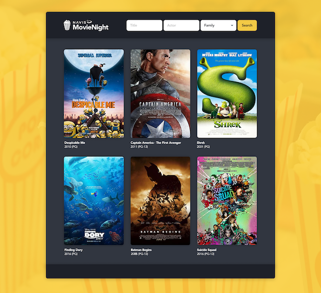
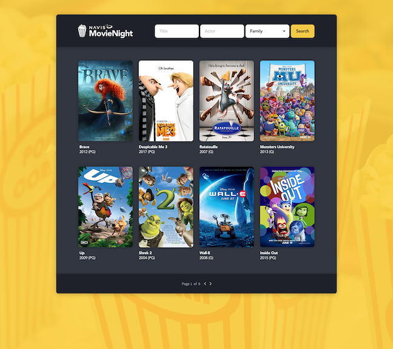
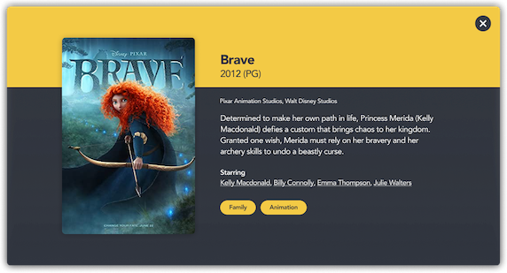

# Navis Movie Night
The movie application consists of two components, a React UI and a Java server backend written in Spring Boot.

We have supplied working frameworks for development of these applications that provide a simple starting point
and are a subset of the technologies used at Navis. For exercise purposes we have limited those for you.

## Full-Stack Engineer
Please extend our starter project to provide a fully functioning movie search application. For this exercise we have supplied a database, image assets, and basic styles. A landing page is implemented with a call to show a UI with a search bar and 6 highlighted movies. Following the setup instructions for the client and server you should see a UI that looks similar to the following when you run the project (note: provided styles will not render exact to the example image.):

### User Stories
Please implement the following stories:

**USER STORY 1**

As a user I want to be able to search by Title, Actor, and/or Genre. Once I type/select my choices and hit "Search" I should be shown movies that match my criteria in a paged view. 

**Acceptance Criteria**
- User can search by any combination of the 3 fields and results should match that criteria.
- Searches on title or actor should be substring match. Eg: If a user types "Harry" in the title field then the results would show all movies with the word "harry" in the title.
- User is presented a dropdown (combo box) of the genres from the server to search by genre. 
- Search result view will be a paged view of the movie poster image and title
- User should be shown an empty result with a message if no results match their search criteria
- User should be able to change the search from the results page and search repeatedly.
- The styles provided by Navis are sufficient and pixel perfect match to spec image is not required (see extra credit section).

The home page should look something like:

The search results view should look something like:

**USER STORY 2**

As a user I want to select a movie from Home or search results page and see a modal view of the movie information.

  **Acceptance Criteria**
- When user clicks a movie poster image or title a modal dialog is presented to user with the movie detail info.
- Movie details shown to user will include: Poster image, title, year released, description/plot, actors, and genre(s)
- User will be presented with an 'X' button to close the detail modal view
- User should be able to hit 'esc' key to close modal
- The styles provided by Navis are sufficient and pixel perfect match to spec image is not required.

The detail view should look something like:

### Extra Credit
1. Make the UI look just like our example images to showcase your UI skills.
2. Implement a search by genre or actor from the detail view

### Expectations of delivery
1. Please provide as production worthy of code as you can but do not spend more than a day on this effort.
2. You may deliver back a zip file of the project or provide a link to a github directory.

### Component Info
Information for each component can be found here:
  - [Client](client/README.md)
  - [Server](server/README.md)
