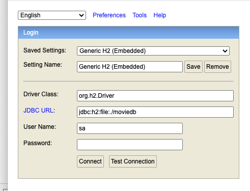

# Server

### Build and Run
Ensure you have maven and open jdk 11 installed. 

```mvn install```

```java -jar spring-boot-0.0.1-SNAPSHOT.jar```

### Dev tools
Feel free to use any IDE you are comfortable with to modify this project.


### Database 
Included in this project is an H2 
database that is created automatically during application startup.

You can access this database on the same port as the started server by using
the following URL:

http://localhost:8080/h2-console

Once you get into that page you can connect to that database via the UI:




The filename is in the local directory for that server:  
jdbc:h2:file:./moviedb
Username: sa
Password: 

Once you connect to the database you can see a database UI for that H2 database:


### Home Page
You can access the index.html endpoint via http://localhost:8080

All image resources can be found in the path http://localhost:8080/images for example: http://localhost:8080/images/alien.jpg

### Swagger
The swagger UI can be accessed via: http://localhost:8080/swagger-ui.html

